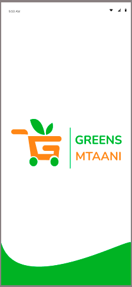
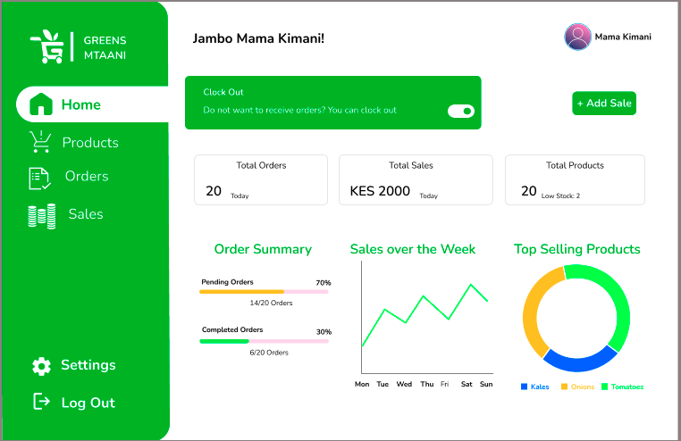

# Greens Mtaani Product Documentation

Welcome to the official documentation repository for **Greens Mtaani**, a digital platform dedicated to empowering local informal grocery vendors (Mama Mboga) and their customers across Kenya. Our platform connects communities by enabling easy access to fresh produce, streamlined ordering, and seamless payments.

---

## Project Overview

Greens Mtaani aims to enhance the relationship between traditional informal vendors and modern-day consumers by providing a comprehensive toolset that includes:

- Inventory management tailored for Mama Mboga vendors.
- Order handling, supporting both individual purchases and group buying.
- Mobile payment integration through secure M-Pesa transactions.
- Sales performance monitoring for vendors to grow their businesses.
- User-friendly interfaces for customers to browse, plan nutrition, and shop conveniently.

The platform’s goal is to increase vendor revenue, reduce waste through better inventory control, and promote healthy eating within communities by making fresh produce more accessible.

---

## Documentation Structure

The documentation is organized into key sections for your ease of use:

- [Introduction](documentation/introduction.md): Background on Greens Mtaani, its mission, users, and the challenges it addresses.
- [Getting Started](documentation/getstarted.md): Instructions on how to begin using the vendor portal and customer app.
- [Vendor Guide](documentation/mama-mboga-guide.md): Detailed walkthroughs to help Mama Mboga vendors effectively manage their products, orders, and payments.
- [Customer Guide](documentation/customer-guidance.md): Guidance for shoppers to explore produce, create nutrition plans, participate in group buying, and complete payments.
- [Group Buying System](documentation/system.md): Explanation on how group orders work, maximizing savings and efficiency.
- [FAQs](documentation/faq.md): Frequently asked questions answered for both vendors and customers.

---

Thank you for choosing Greens Mtaani as your partner in bringing fresh groceries closer to your community. Together, we support local business growth and enhance the shopping experience for everyone.

---

*For contributions, bug reports, or feature requests, please follow the repository guidelines or contact the Greens Mtaani development team.*