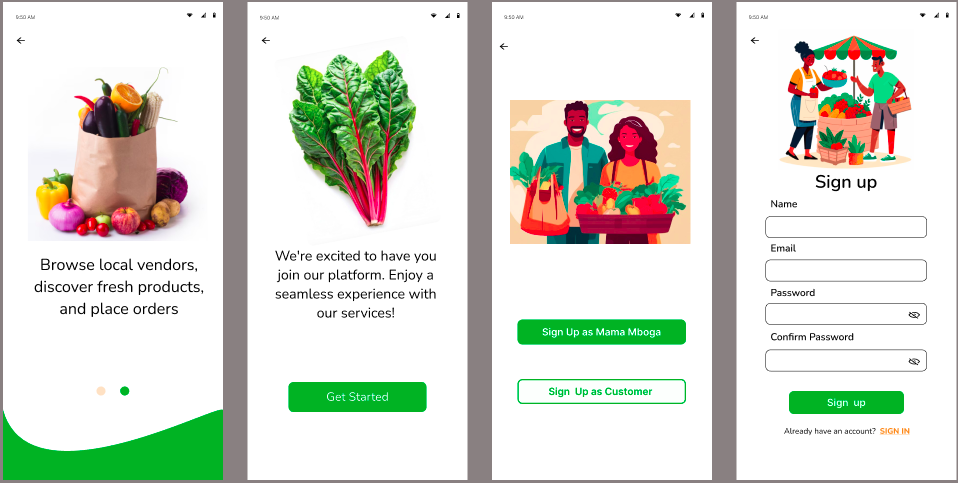

Vendor Guide

# Greens Mtaani Vendor Guide (Mama Mboga PWA)

Welcome to the Greens Mtaani Vendor Guide! This document will help you, as a Mama Mboga vendor, effectively use the Greens Mtaani Progressive Web App (PWA) to manage your product inventory, process customer orders, monitor sales, and handle payments smoothly.

## 1. Accessing the Vendor Portal

- Open your preferred web browser and navigate to the Greens Mtaani PWA URL.  
- Log in with your registered username and password.  
- If you don’t have an account, select **Register** to create a new vendor profile.  

## 2. Managing Your Inventory

Keeping your product list up to date ensures your customers see accurate availability and prices.

### Adding New Products

- From your dashboard, go to the **Inventory** section.  
- Click **Add Product** and fill in details such as:  
  - Product name  
  - Description  
  - Price  
  - Stock quantity  
- Save to add the product to your active inventory.

### Updating Existing Products

- In the **Inventory** area, select a product to edit its details.  
- Modify price, quantity, or description as needed.  
- Save your updates to immediately reflect changes in the app.

## 3. Processing and Tracking Orders

### Group Orders

- View ongoing group orders on your dashboard.  
- When a group order reaches the required minimum quantity, it will close automatically and payment requests are sent to customers.  
- Prepare the products for pickup or delivery as instructed.

### One-time Orders

- Monitor incoming orders individually.  
- Confirm order status changes (e.g., prepared, ready for pickup) as you process them.  

## 4. Handling Payments

- Greens Mtaani integrates with M-Pesa for secure mobile money transactions.  
- Payment requests are sent via STK Push to customers’ mobile phones.  
- Check the **Payments** section regularly to verify received payments.  
- Follow up on any pending or failed payments to ensure smooth processing.

## 5. Tips to Maximize Success

- Regularly update your inventory to avoid order cancellations due to unavailability.  
- Analyze your sales reports to identify best-sellers and optimize stock.  
- Leverage group buying features to boost bulk sales.  
- Respond promptly to new orders and customer inquiries to maintain great vendor ratings.

## 6. Support and Assistance

- Visit the Greens Mtaani [FAQs](#) for answers to common questions.  
- Contact vendor support via the app for personalized help.

**Thank you for partnering with Greens Mtaani to bring fresh, convenient grocery shopping to your community!**

